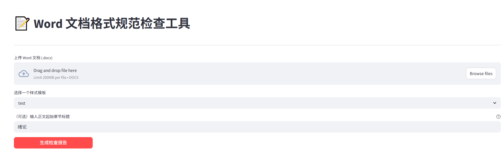
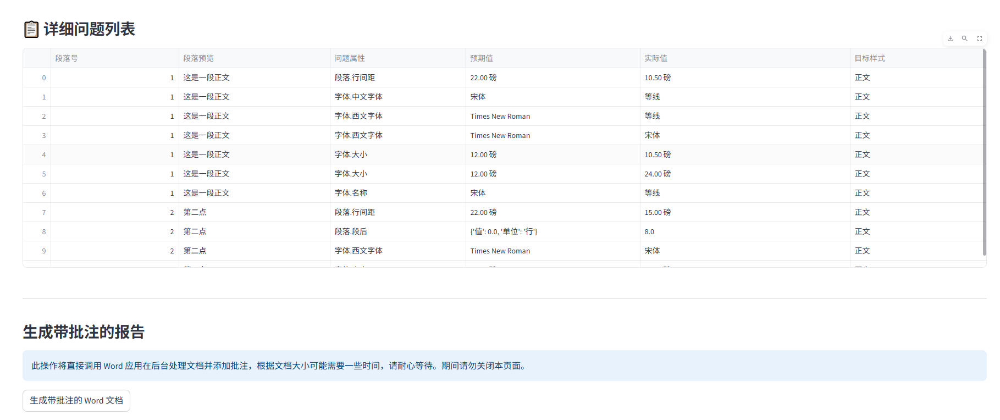
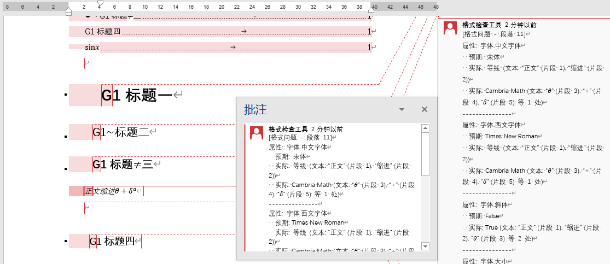

# Word 文档格式规范检查工具 (win32com 版)

肉眼检查word格式问题，又累又慢，交给本项目自动化解决吧！
本项目是一个检查 Word 文档格式是否符合特定规范的Web应用（体检大夫）。它能生成图文并茂的检查报告和详细的带批注的 Word 文档。
## ✨ 效果演示



_图1: 主页_


_图2: 生成的格式检查报告_


_图3: 格式错误细节报告_


_图4: 生成的带批注 Word 文档_

## 🚀 快速上手流程

<details>
<summary>点击查看项目上手流程概览 (流程图)</summary>


**快速导航:**
* [⚙️ 2. 安装指南](#2-安装指南)
* [🛠️ 3. 配置说明](#3-配置说明)
* [▶️ 4. 使用方法](#4-使用方法)
</details>

## 1. 功能特性

*   **格式检查**: 用户上传 Word 文档，选择预设或自定义的样式模板（JSON 格式）。
*   **智能样式映射 (LLM)**: 集成大型语言模型 (LLM) 对文档段落进行智能分析，辅助判断段落应匹配的模板样式，提高复杂文档的映射准确率。
*   **报告生成**:
    *   显示包含评分、评价和图表的格式检查报告。
    *   可生成带详细批注的 Word 文档，指出不符合规范的具体位置。
*   **模板管理**:
    *   用户可以手动创建和保存自定义的样式模板。
    *   模板以 JSON 文件形式存储，元数据通过 SQLite 数据库管理。
*   **纯本地运行**: 无需服务器部署或复杂的后台任务队列，所有操作在用户本地计算机上同步执行。

## 2. 安装指南

### 2.1. 环境要求

*   **操作系统**: Windows (因为依赖 `win32com` 和 Microsoft Word)
*   **Microsoft Word**: 需要安装 Microsoft Word 2007 或更高版本。
*   **Python**: 建议使用 Python 3.9 或更高版本。
*   **大模型API**: 默认使用大模型来完成智能样式映射功能，需要能够访问大模型API的服务。如果不使用大模型需自行处理样式映射关系

### 2.2. 安装步骤

1.  **克隆或下载项目**:
    ```
    git clone https://github.com/Iberxilong-blackbox/format-comparator.git && cd format-comparator
    ```
   

2.  **创建虚拟环境 (推荐)**:
    在项目根目录打开命令行/终端，执行：
    ```bash
    python -m venv word
    ```

    ```
    word\Scripts\activate  # Windows
    ```
    

3.  **安装依赖库**:
    确保 `requirements.txt` 文件在项目根目录，并包含以下核心依赖 (以及它们各自的依赖)：
    *   `streamlit`
    *   `pandas`
    *   `plotly`
    *   `pywin32` 
    *   `openai` 
    *   `fuzzywuzzy` (可选，用于 LLM 样式名模糊匹配)

    在激活的虚拟环境中执行：
    ```bash
    pip install -r requirements.txt
    ```
    如果 `requirements.txt` 文件由于某种原因无法使用，您可以尝试手动安装核心依赖：
    ```bash
    pip install streamlit pandas plotly pywin32 openai fuzzywuzzy
    ```

## 3. 配置说明

### 3.1. 用户文件目录

应用运行时，会在根目录下自动创建 `user_files/` 子目录，用于存放：
*   `user_files/templates_map.db`: 存储模板元数据的 SQLite 数据库。
*   `user_files/templates/`: 存放用户创建的模板 JSON 文件。
*   `user_files/commented_docs/`: 存放生成的带批注的 Word 文档。
*   `user_files/tolerance_config.json`: 格式比较的容差配置文件。如果此文件不存在，应用首次运行时会自动创建一个包含默认值的版本。您可以根据需要修改此文件中的容差设置。

### 3.2. LLM 服务配置 

如果希望使用 LLM 进行智能样式映射，需要在项目根目录下创建一个 [`config.json`](config.json:0) 文件。可以参考同目录下的 `config_example.json` 文件进行创建。

**[`config_example.json`](config_example.json:0) 内容示例:**
```json
{
  "llm": {
    "provider": "deepseek",
    "api_key": "<YOUR_API_KEY_HERE>",
    "base_url": "<YOUR_LLM_API_URL_HERE>",
    "model": "deepseek-chat",
    "max_tokens": 4096,
    "response_format": {"type": "text"}
  }
}
```
**说明:**
*   将 `<YOUR_API_KEY_HERE>` 替换为你的 LLM 服务 API 密钥。
*   将 `<YOUR_LLM_API_URL_HERE>` 替换为你的 LLM 服务的基础 URL。
*   `provider` 和 `model` 可以根据你使用的 LLM 服务进行调整。
*   如果项目根目录下的 [`config.json`](config.json:0) 文件不存在或无法正确加载，LLM 功能将被跳过。

### 3.3. 容差配置 (`user_files/tolerance_config.json`)

此文件允许您为特定的格式属性设置比较时的容差。例如：
```json
{
  "pt_tolerance": 0.1, // 默认磅值容差
  "multiple_tolerance": 0.05, // 默认倍数行距容差
  "specific_tolerances": {
    "段落.首行缩进.pt": 1.0, // 首行缩进允许1磅的误差
    "字体.大小.pt": 0.5     // 字体大小允许0.5磅的误差
  }
}
```
您可以根据实际需求调整这些值。属性键的格式为 `类别.属性名.单位`。

## 4. 使用方法
0.  **优先确保上述第三步已配置完成**
1.  **启动应用**:
    在已激活虚拟环境的命令行/终端中，确保您位于项目的根目录下，然后运行：
    ```bash
    streamlit run app.py
    ```
    应用将在浏览器中打开。
**注意**: 首次运行应用时，请务必先通过“create template”页面 (在 `http://localhost:8501/create_template`) 创建并保存一个样式模板，之后才能进行格式检查。

2.  **创建样式模板 (如果需要)**:
    *   如果系统中没有合适的模板，请先通过应用内的“创建/编辑样式模板”页面 (通常在 `http://localhost:8501/create_template`) 创建新的模板。
    *   填写模板名称、学校、专业等基本信息。
    *   为正文、各级标题、图题、表题等主要样式配置详细的字体和段落属性。
    *   （可选）配置目录和编号样式。
    *   点击“保存模板”。

3.  **进行格式检查**:
    *   返回主应用页面 (`app.py`)。
    *   点击“上传 Word 文档”按钮，选择要检查的 `.docx` 文件。
    *   从下拉列表中选择一个已创建的样式模板。
*   **关于“（可选）输入正文起始章节标题”**：如果您的输入文档是论文（如毕业论文、期刊文章等），建议在此处准确输入论文正文第一章的完整标题（例如：“第一章 引言”或“1 绪论”）。这有助于系统更精确地定位正文内容的起始位置，否则可能会影响部分检查功能的准确性。其他类型的文档可视情况填写。
    *   点击“生成检查报告”按钮。
    *   应用将分析文档（如果配置了 LLM，会尝试使用 LLM 进行样式映射），并在页面上显示包含评分、评价、图表和详细问题列表的报告。

4.  **生成带批注的文档**:
    *   在显示检查报告后，页面下方会出现“生成带批注的 Word 文档”按钮。
    *   点击此按钮，应用会调用本地 Word 程序在后台处理文档并添加批注。此过程可能需要一些时间，请耐心等待。
    *   完成后，会提供下载按钮，您可以下载包含详细格式问题批注的 Word 文档。

## 5. 注意事项

*   **Microsoft Word 依赖**: 本应用强依赖本地安装的 Microsoft Word。请确保 Word 程序可以正常运行。在处理文档期间，Word 可能会在后台启动。
*   **LLM 配置**: 使用 LLM 功能，请确保已正确创建并配置项目根目录下的 [`config.json`](config.json:0) 文件。
*   **性能**: 对于文字较多的文档，`win32com` 的处理速度可能会较慢。LLM 调用也可能需要额外时间。
*   **错误处理**: 如果遇到 `win32com` 相关的错误，通常与 Word 环境或文档本身有关。尝试关闭所有word文档，或重启 Word 以及检查文档是否损坏。LLM 相关错误会打印到控制台。
*   **安全性**: 由于使用 `win32com`，应用会直接与本地 Word 程序交互。请确保只处理来自可信来源的文档。


## 6. 待办与未来改进

*   完善 TOC 和多级列表编号的 UI 配置界面。
*   增加模板编辑功能。
*   提供更详细的错误日志和用户反馈界面。
*   考虑打包为独立可执行文件 (如使用 PyInstaller)。
*   优化 LLM Prompt 和解析逻辑，提高映射准确性和鲁棒性。

---
祝您使用愉快！